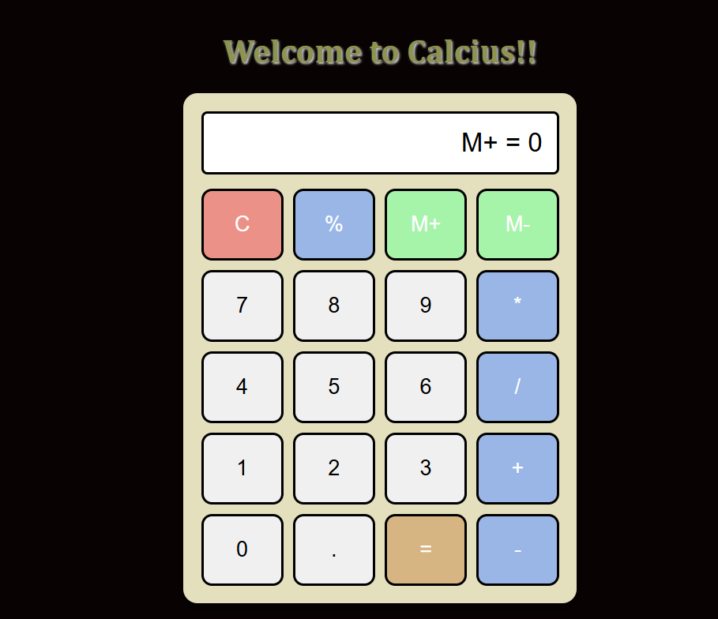

# Calcius - Simple Calculator

**Calcius** is a **web-based calculator** built using **HTML, CSS, and JavaScript**.  
It allows users to perform **basic arithmetic operations** (addition, subtraction, multiplication, division) and includes **memory functions** (M+ and M-).  

---

## **Features**

- Basic arithmetic operations: `+`, `-`, `*`, `/`
- Clear input (`C`)
- Memory storage and retrieval (`M+`, `M-`)
- Responsive design for desktop and mobile
- Easy-to-use interface

---

## **Technologies Used**

- **HTML5** – Structure of the calculator
- **CSS3** – Styling and responsive layout
- **JavaScript** – Button functionality and calculations

---

## **Screenshots**

  

---

## **Usage**

1. Clone the repository:

```bash
git clone https://github.com/<sayeeg-11>/calcius-calculator.git
```
2. Open the project folder.
3. Open index.html in any web browser.
4. Start using the calculator.

## Author

 Sayee Gosavi
 - B.Tech IT Student | Web Development Enthusiast
